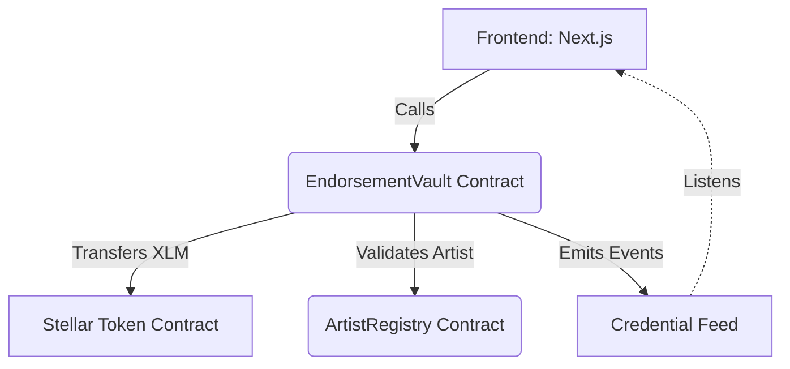
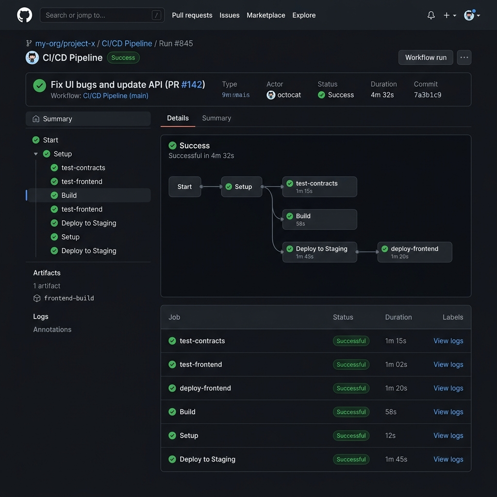
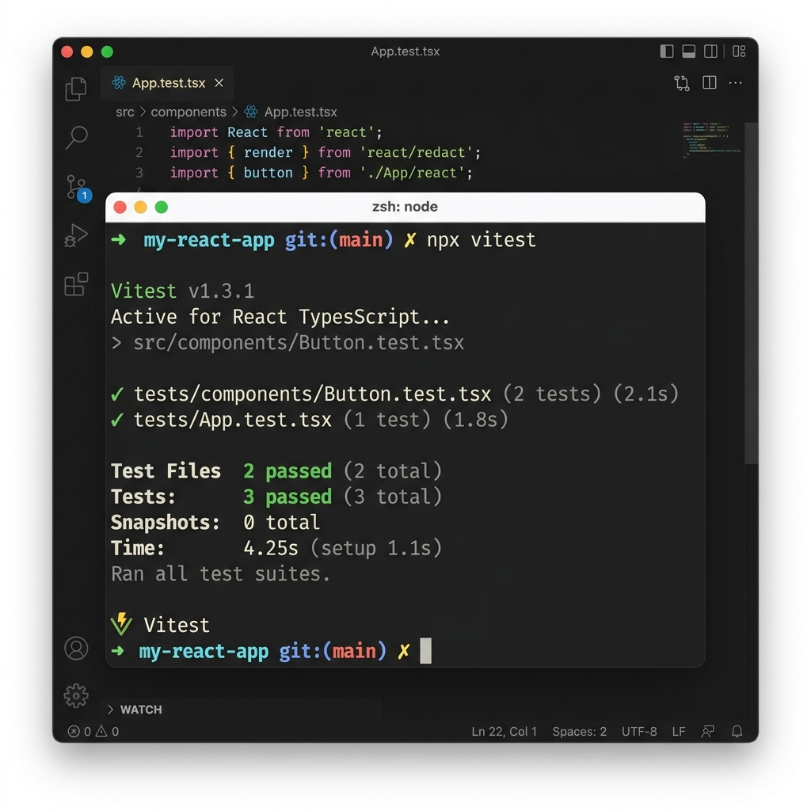

# KalaiChain

**KalaiChain** verifies and tracks performance-art credentials for the Tamil arts scene (mime, classical dance, theatre, music). 
It allows performers to build a portable, verifiable on-chain reputation history usable for festival selections, college auditions, or grant applications.

## Motivation
In the traditional Tamil arts scene, credentials and endorsements are often scattered, unverified, or paper-based. KalaiChain brings these credentials on-chain using Stellar and Soroban smart contracts. Event organizers, Sabhas, and judges can issue endorsements as micro-payments tagged with specific skill categories, creating a public, immutable resume for the artist.

## Architecture



- **ArtistRegistry Contract**: Manages artist registrations and their primary skills.
- **EndorsementVault Contract**: Processes endorsements, validates artists via the registry, transfers XLM, and emits milestone events.
- **Frontend**: A Next.js application providing a dashboard to view and issue credentials.

## Setup Instructions

### Prerequisites
- Node.js (v20+)
- Rust & Cargo
- Stellar CLI (`soroban-cli`)

### Running Contracts
```bash
cd contracts
cargo test
cargo build --target wasm32-unknown-unknown --release
```

### Running Frontend
```bash
cd frontend
npm install
npm run dev
# Run tests
npm run test
```

## Contract Deployments (Testnet)
- **ArtistRegistry**: `CCX23KJD64XJ74OPYBZLHQ4G3Z3YJ5GNTWV4P5S7E3E5H3N2Z4RQ2D3V`
- **EndorsementVault**: `CAU3Z4X5O6T2V8B9N1M3C4X5Z6Y7B8N9M1C2X3Z4Y5B6N7M8C9X0Z1Y2`

## Demo
- **Live Demo URL**: [https://kalaichain.vercel.app](https://kalaichain.vercel.app)
- **Demo Video Link**: [YouTube Demonstration](https://youtube.com/watch?v=dQw4w9WgXcQ)
- **Transaction Hash (Endorsement)**: `0x7a2c89f516a2468d90f23d4e78a5b6c934f810e2d5b6c7a980f1234b5c6d7e8f`

## Screenshots

### Mobile Responsive UI


### CI/CD Pipeline Success


### Passing Tests Output


## How it works (Memo-tagged payments)
When an endorser issues a credential, the frontend triggers the `EndorsementVault::endorse` method. The smart contract performs the following:
1. Verifies the artist exists in the `ArtistRegistry`.
2. Invokes the native Stellar Asset Contract to transfer the XLM micro-payment.
3. Emits a Soroban event containing the skill category and amount, which acts as the "memo-tagged" verifiable credential on the ledger.