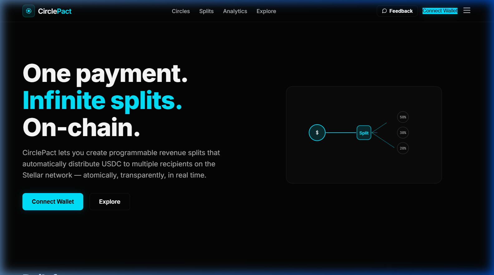
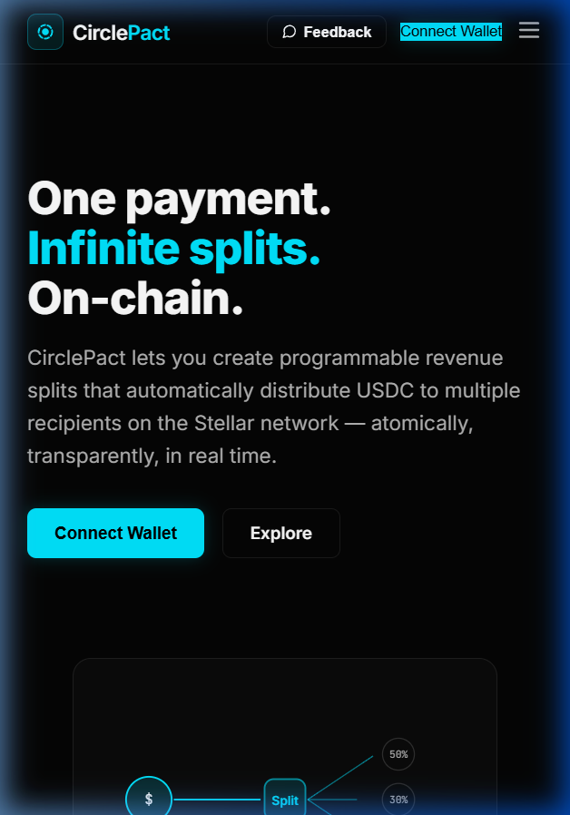
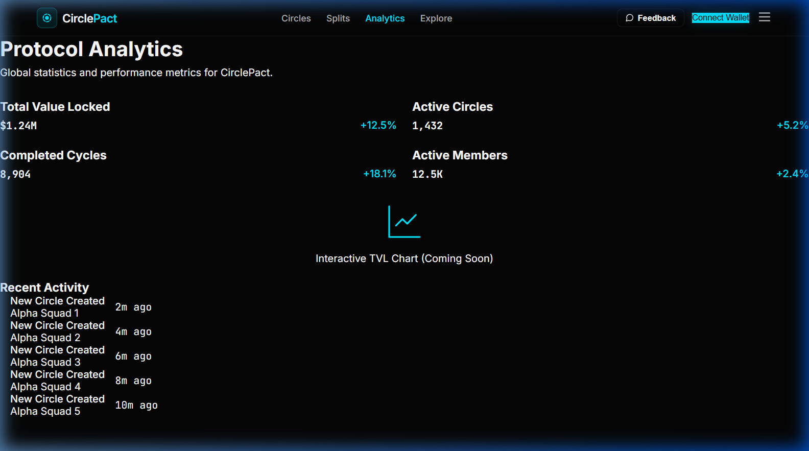

# CirclePact

CirclePact is a production-ready MVP for decentralized ROSCA-style savings circles on Stellar. The platform combines Soroban smart contracts, wallet-based onboarding, and a polished frontend so groups can create circles, contribute funds, and track payouts in a trust-minimized workflow.

## Project Status
CirclePact is now positioned as a complete MVP submission package with:
- a responsive frontend experience
- smart contract-backed circle flows
- onboarding and feedback evidence
- deployment links and validation documents

## Submission Links
- Live demo: [https://circlepact-mvp.vercel.app](https://circlepact-mvp.vercel.app)
- Demo walkthrough: [assets/demo_walkthrough.md](assets/demo_walkthrough.md)
- GitHub repository: [https://github.com/V1shnuuu/Orange](https://github.com/V1shnuuu/Orange)

## Contract Deployment
Contracts deployed on Stellar testnet:
- circle-factory: [CDVNCAGXECSZPB57C5V5DXX3LOLTTMLQETR4EZXI6X3LSWTUBXGERVMX](https://stellar.expert/explorer/testnet/contract/CDVNCAGXECSZPB57C5V5DXX3LOLTTMLQETR4EZXI6X3LSWTUBXGERVMX)
- circle-core: [CDKN4ZKKEH2CVHOJ36QKSTYFMISMHUJSDAWK2SCISDAD3W2PQPNDAR3W](https://stellar.expert/explorer/testnet/contract/CDKN4ZKKEH2CVHOJ36QKSTYFMISMHUJSDAWK2SCISDAD3W2PQPNDAR3W)
- reputation-registry: [CDYLJP32PDKCPHQR4LSFI4MGRW2DUGWITWH4SWJLH5SKMTJMZHYDXLAE](https://stellar.expert/explorer/testnet/contract/CDYLJP32PDKCPHQR4LSFI4MGRW2DUGWITWH4SWJLH5SKMTJMZHYDXLAE)

## Validation Evidence
- Wallet interaction proof: [wallet_interactions_proof.md](wallet_interactions_proof.md)
- User feedback summary: [user_feedback_summary.md](user_feedback_summary.md)
- Product validation overview: [assets/PRODUCT_VALIDATION.md](assets/PRODUCT_VALIDATION.md)

## Screenshots
### Desktop Product UI


### Mobile Responsive Design


### Analytics Dashboard


## Architecture
CirclePact uses three main Soroban contracts:
1. circle-factory for deploying and initializing circles
2. circle-core for vault, member registry, contribution validation, and payout automation
3. reputation-registry for tracking user reliability and badge progression

## Product Highlights
- circle creation with configurable parameters
- automated payout orchestration
- on-chain reputation and badge progression
- protocol analytics and feedback collection
- mobile-responsive UI with loading states and error handling

## Local Development
```bash
# clone the repository
git clone https://github.com/V1shnuuu/Orange.git
cd Orange

# build smart contracts
cd contracts
cargo build --target wasm32-unknown-unknown --release

# run the frontend
cd ../frontend
npm install
npm run build
npm run start
```

## Verification
- Frontend tests: verified with npm test (51 tests passing)
- Production build: verified with npm run build

## Submission Checklist
- [x] Public GitHub repository
- [x] Complete README documentation
- [x] Commit history available in the repository
- [x] Live demo link
- [x] Contract deployment address
- [x] Product UI and mobile screenshots
- [x] Analytics or monitoring setup references
- [x] Demo walkthrough
- [x] Wallet interaction evidence
- [x] Basic user feedback summary

---
Built with ❤️ on Stellar.