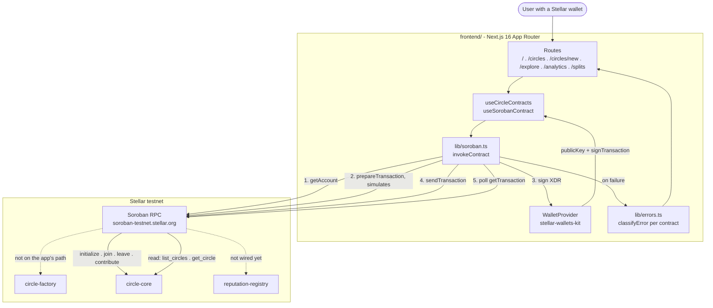
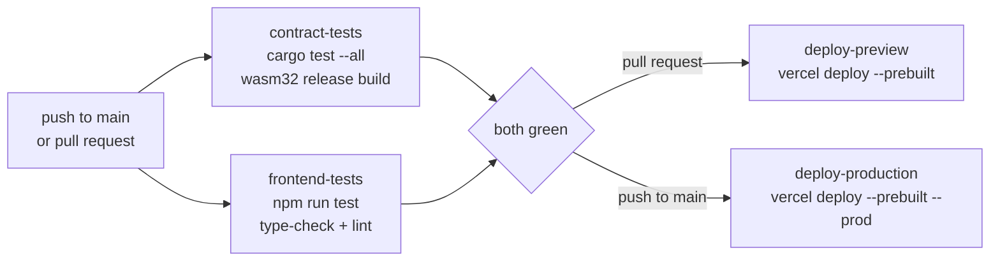

# CirclePact

ROSCA-style savings circles on Stellar. A group agrees on a fixed contribution,
everyone pays into each cycle, and the pot rotates to one member per cycle until
everyone has been paid once.

The repo is a monorepo: a Soroban contract workspace in Rust (`contracts/`) and a
Next.js 16 frontend (`frontend/`), plus compiled Midnight Compact artifacts
(`managed/`).

## Links

- Live demo: [https://orange-ten-lac.vercel.app/](https://orange-ten-lac.vercel.app/)
- Demo walkthrough: [assets/demo_walkthrough.md](assets/demo_walkthrough.md)
- GitHub repository: [https://github.com/V1shnuuu/Orange](https://github.com/V1shnuuu/Orange)
- CI pipeline: [.github/workflows/ci.yml](.github/workflows/ci.yml)

Contracts deployed on Stellar testnet:

- circle-factory: [CDVNCAGXECSZPB57C5V5DXX3LOLTTMLQETR4EZXI6X3LSWTUBXGERVMX](https://stellar.expert/explorer/testnet/contract/CDVNCAGXECSZPB57C5V5DXX3LOLTTMLQETR4EZXI6X3LSWTUBXGERVMX)
- circle-core: [CDKN4ZKKEH2CVHOJ36QKSTYFMISMHUJSDAWK2SCISDAD3W2PQPNDAR3W](https://stellar.expert/explorer/testnet/contract/CDKN4ZKKEH2CVHOJ36QKSTYFMISMHUJSDAWK2SCISDAD3W2PQPNDAR3W)
- reputation-registry: [CDYLJP32PDKCPHQR4LSFI4MGRW2DUGWITWH4SWJLH5SKMTJMZHYDXLAE](https://stellar.expert/explorer/testnet/contract/CDYLJP32PDKCPHQR4LSFI4MGRW2DUGWITWH4SWJLH5SKMTJMZHYDXLAE)

> **The deployed `circle-core` and `reputation-registry` are older builds and
> the app will not work against them.** Both were rewritten: `circle-core` is
> now multi-tenant, so one deployment backs many circles, and every entry point
> takes a `circle_id`; `reputation-registry` now requires an admin and an
> authorized writer. Redeploy both and update the contract ids before using the
> app — see [Deploying the contracts](#deploying-the-contracts).

Midnight: `contracts/CirclePact.compact` compiles against the Compact standard
library and its artifacts are checked into `managed/`, but it is not deployed to
a live Midnight network.

## Features

- **Five Soroban contracts** (`soroban-sdk` 22): `circle-core` runs the ROSCA
  cycle engine and holds the funds, `reputation-registry` tracks per-member
  scores, `circle-factory` keeps a per-admin circle registry. `split-registry`
  and `payment-vault` implement a separate payment-splitting flow.
- **Multi-tenant circles.** State is keyed by `circle_id`, so one `circle-core`
  deployment backs any number of concurrent circles and a wallet can belong to
  several at once.
- **Fixed-amount cycle engine.** The per-cycle contribution is set when the
  circle is opened and `contribute` rejects anything else, so the pot always
  equals `contribution x member_count`. A circle auto-starts once it fills, and
  payouts rotate in join order until every member has been paid once.
- **Seats can be given up.** `leave_circle` frees a seat while the circle is
  still filling, so a circle one member short is recoverable rather than dead.
- **Reputation scoring, write-protected.** Successful, late, and defaulted
  cycles feed a completion rate and badge tiers (Bronze → Diamond); a single
  default clears a member's badge. Only addresses on an admin-managed writer
  allowlist can record scores, so a wallet cannot inflate its own standing.
- **Feedback that is actually delivered.** `POST /api/feedback` validates a
  submission and forwards it to a configured webhook, reporting failure rather
  than showing a false confirmation.
- **Wallet onboarding** through `@creit.tech/stellar-wallets-kit`, loaded
  dynamically so the kit is only fetched when a user connects.
- **Full transaction lifecycle in the UI** — simulate, sign, submit, poll for
  confirmation — with contract errors decoded against the contract that raised
  them rather than a single shared table.
- **SEO routes** generated from one canonical origin: `app/robots.ts` and
  `app/sitemap.ts` both read `SITE_URL` from `lib/site.ts`.
- **CI gates everything**: contract tests, wasm build, frontend tests, type
  check, lint, then Vercel preview/production deploys.

## Workflow

How a circle action travels from the browser to the chain. Creating, joining,
leaving and contributing all take this path — each is a wallet-signed
transaction against `circle-core`.


```mermaid
flowchart TD
    User(["User with a Stellar wallet"])

    subgraph fe["frontend/ - Next.js 16 App Router"]
        Pages["Routes<br>/ . /circles . /circles/new . /explore . /analytics . /splits"]
        Wallet["WalletProvider<br>stellar-wallets-kit"]
        Hooks["useCircleContracts<br>useSorobanContract"]
        Invoke["lib/soroban.ts<br>invokeContract"]
        Errors["lib/errors.ts<br>classifyError per contract"]
    end

    subgraph chain["Stellar testnet"]
        RPC["Soroban RPC<br>soroban-testnet.stellar.org"]
        Factory["circle-factory"]
        Core["circle-core"]
        Rep["reputation-registry"]
    end

    User --> Pages
    Pages --> Hooks
    Wallet -->|"publicKey + signTransaction"| Hooks
    Hooks --> Invoke

    Invoke -->|"1. getAccount"| RPC
    Invoke -->|"2. prepareTransaction, simulates"| RPC
    Invoke -->|"3. sign XDR"| Wallet
    Invoke -->|"4. sendTransaction"| RPC
    Invoke -->|"5. poll getTransaction"| RPC
    Invoke -->|"on failure"| Errors
    Errors --> Pages

    RPC -->|"initialize . join . leave . contribute"| Core
    RPC -->|"read: list_circles . get_circle"| Core
    RPC -.->|"not wired yet"| Rep
    RPC -.->|"not on the app's path"| Factory
```

## Installation

Prerequisites: Rust with the `wasm32-unknown-unknown` target, Node.js 20+, and a
Stellar wallet extension (Freighter, xBull, or Albedo) for the browser.

```bash
# clone the repository
git clone https://github.com/V1shnuuu/Orange.git
cd Orange

# build smart contracts
cd contracts
cargo build --target wasm32-unknown-unknown --release

# run the frontend
cd ../frontend
npm install
npm run build
npm run start
```

For frontend development with hot reload, use `npm run dev` instead of
`npm run build && npm run start`.

## Usage

Frontend scripts, all run from `frontend/`:

| Script | What it does |
|--------|--------------|
| `npm run dev` | Next dev server on `localhost:3000` |
| `npm run build` | Production build |
| `npm run start` | Serve the production build |
| `npm run test` | Vitest suite (jsdom) |
| `npm run type-check` | `tsc --noEmit` |
| `npm run lint` | ESLint |
| `npm run format` | Prettier over `ts,tsx,md,json` |

Contract commands, run from `contracts/`:

```bash
cargo test --all                                    # unit tests for all five crates
cargo build --target wasm32-unknown-unknown --release  # deployable wasm
```

Once the app is running, connect a wallet. Every circle action is a real
transaction — simulated, signed in your wallet, submitted to testnet, and polled
until confirmation:

| Action | Contract call |
|--------|---------------|
| Create a circle | `initialize`, then `join_circle` to take the first seat |
| Join an open circle | `join_circle` |
| Give up a seat before the circle starts | `leave_circle` |
| Pay into the current cycle | `contribute` |

The circle list and dashboard are read straight from the chain with
`list_circles` and `get_circle`, which simulate without signing and work with no
wallet connected. A circle auto-starts once every seat is taken; when all
members have paid into a cycle the pot transfers to the next member in join
order.

If the account has never been funded, the error path offers a Friendbot link to
fund it with test XLM.

## Configuration

`frontend/.env.example` lists all of these. `NEXT_PUBLIC_CIRCLE_CORE_CONTRACT_ID`
and `NEXT_PUBLIC_USDC_TOKEN_CONTRACT_ID` are the two the circle flow cannot work
without.

The live demo currently serves from `https://orange-ten-lac.vercel.app/`, so set
`NEXT_PUBLIC_SITE_URL` to match — otherwise `robots.txt` and `sitemap.xml`
advertise the old default.

| Variable | Default | Purpose |
|----------|---------|---------|
| `NEXT_PUBLIC_STELLAR_RPC_URL` | `https://soroban-testnet.stellar.org` | Soroban RPC endpoint |
| `NEXT_PUBLIC_STELLAR_NETWORK_PASSPHRASE` | `Test SDF Network ; September 2015` | Network passphrase for signing |
| `NEXT_PUBLIC_STELLAR_NETWORK` | `testnet` | Gates testnet-only features such as Friendbot |
| `NEXT_PUBLIC_CIRCLE_FACTORY_CONTRACT_ID` | empty | circle-factory address |
| `NEXT_PUBLIC_CIRCLE_CORE_CONTRACT_ID` | empty | circle-core address |
| `NEXT_PUBLIC_REPUTATION_REGISTRY_CONTRACT_ID` | empty | reputation-registry address |
| `NEXT_PUBLIC_SPLIT_REGISTRY_CONTRACT_ID` | empty | split-registry address |
| `NEXT_PUBLIC_PAYMENT_VAULT_CONTRACT_ID` | empty | payment-vault address |
| `NEXT_PUBLIC_USDC_TOKEN_CONTRACT_ID` | empty | Token contract moved by `contribute` |
| `NEXT_PUBLIC_SITE_URL` | `https://circlepact-mvp.vercel.app` | Canonical origin for `robots.txt` and `sitemap.xml` |
| `FEEDBACK_WEBHOOK_URL` | unset | Server-side only. Where `/api/feedback` forwards submissions; unset makes the route return 503 |

Set `NEXT_PUBLIC_SITE_URL` per deployment so preview builds advertise themselves
rather than pointing crawlers at production.

Vercel deploys additionally need `VERCEL_TOKEN`, `VERCEL_ORG_ID`, and
`VERCEL_PROJECT_ID` as repository secrets.

## Project structure

```
.
├── contracts/                   Soroban workspace (Rust, soroban-sdk 22)
│   ├── circle-factory/          create_circle, per-admin circle registry
│   ├── circle-core/             ROSCA engine: join, contribute, rotate payouts
│   ├── reputation-registry/     per-member scores and badge tiers
│   ├── split-registry/          recipient and share configuration
│   ├── payment-vault/           distributes one payment across a split
│   ├── CirclePact.compact       Midnight Compact contract source
│   └── Cargo.toml               workspace members and release profile
├── frontend/                    Next.js 16 App Router, React 19, Tailwind 4
│   ├── src/app/                 routes plus robots.ts and sitemap.ts
│   ├── src/components/          UI components and __tests__/
│   ├── src/hooks/               wallet, contract, and UI hooks
│   ├── src/lib/                 soroban.ts, stellar.ts, contracts.ts, errors.ts, site.ts
│   └── vitest.config.ts         jsdom test setup
├── managed/                     compiled Midnight Compact artifacts
├── assets/                      screenshots and supporting documents
├── .github/workflows/ci.yml     tests, wasm build, Vercel deploys
├── CONTRIBUTING.md
└── LICENSE
```

## Testing and CI

Verified locally on 2026-08-21:

- `cargo test --all` in `contracts/` — **59 tests** across the five crates
- `cargo build --target wasm32-unknown-unknown --release` — all five crates
- `npm run test` in `frontend/` — **91 tests** across 11 files
- `npm run type-check` — clean
- `npm run lint` — clean
- `npm run build` — 13 routes, including `/api/feedback` and the generated
  `/robots.txt` and `/sitemap.xml`

Every one of those is gated in [.github/workflows/ci.yml](.github/workflows/ci.yml):


```mermaid
flowchart LR
    Trigger["push to main<br>or pull request"] --> CT["contract-tests<br>cargo test --all<br>wasm32 release build"]
    Trigger --> FT["frontend-tests<br>npm run test<br>type-check + lint"]
    CT --> Gate{"both green"}
    FT --> Gate
    Gate -->|"pull request"| Preview["deploy-preview<br>vercel deploy --prebuilt"]
    Gate -->|"push to main"| Prod["deploy-production<br>vercel deploy --prebuilt --prod"]
```

## Deploying the contracts

The contracts in this repo are ahead of what is deployed, and the app talks to
`circle-core` for everything, so it needs a fresh deployment before it works.
With the [Stellar CLI](https://developers.stellar.org/docs/tools/developer-tools/cli/stellar-cli)
and a funded testnet identity:

```bash
cd contracts
cargo build --target wasm32-unknown-unknown --release

# circle-core — the only contract the circle flow needs
stellar contract deploy \
  --wasm target/wasm32-unknown-unknown/release/circle_core.wasm \
  --source <identity> --network testnet

# reputation-registry, then point it at circle-core as its writer
stellar contract deploy \
  --wasm target/wasm32-unknown-unknown/release/reputation_registry.wasm \
  --source <identity> --network testnet

stellar contract invoke --id <reputation-id> --source <identity> \
  --network testnet -- initialize --admin <your-address>

stellar contract invoke --id <reputation-id> --source <identity> \
  --network testnet -- authorize_writer --writer <circle-core-id>
```

Then set `NEXT_PUBLIC_CIRCLE_CORE_CONTRACT_ID`,
`NEXT_PUBLIC_REPUTATION_REGISTRY_CONTRACT_ID` and
`NEXT_PUBLIC_USDC_TOKEN_CONTRACT_ID` in the Vercel project and redeploy the
frontend. `contribute` moves a real token, so the token contract must be one
members actually hold — issue a test asset and distribute it, or point at an
existing testnet asset.

## Current limitations

Worth knowing before reading the code:

- **The deployed contract addresses in this README are stale.** Nothing works
  against them; see above.
- **`reputation-registry` is not called from the app yet.** The contract is
  written, authorized and tested, but `circle-core` does not yet report cycle
  outcomes to it, so badges shown in the UI are not driven by real scores.
- **The `/splits` pages are UI-only.** `split-registry` and `payment-vault` are
  implemented and tested, but nothing in the frontend invokes them;
  `useDistributionEvents` returns generated events.
- **`circle-factory` is no longer on the app's path.** `circle-core` carries the
  circle's name and cycle duration itself, so creating a circle is one contract
  and one signature. The factory keeps its own registry and tests.
- **A late or defaulting member cannot be handled.** A cycle only closes when
  every member pays, so one member who stops paying stalls the circle with the
  others' funds held in the contract. There is no timeout, eviction, or refund
  path yet — this is the most important gap before real money.

## Screenshots

### Desktop Product UI


### Mobile Responsive Design


### Analytics Dashboard


## Product Improvements Shipped

Changes from an internal UX and code audit of the MVP. These are **not** driven
by collected user feedback — none has been gathered yet. Listed with commit
links so the history is traceable.

| Area | Improvement | Commit |
|------|-------------|--------|
| UX / stability | Rebuilt the visual language on a real design-token system. Tailwind was configured but never generating utility classes, so much of the UI was silently rendering unstyled — this fixes the root cause and restyles every page and component. | [`ddbde95`](https://github.com/V1shnuuu/Orange/commit/ddbde95) |
| Onboarding | Wallet-connect failures raised a bare rejection object that the error classifier could not read, so users saw nothing useful. Errors are now classified correctly and surface a wallet-install modal with Freighter / xBull / Albedo links. | [`ddbde95`](https://github.com/V1shnuuu/Orange/commit/ddbde95), [`bb2892f`](https://github.com/V1shnuuu/Orange/commit/bb2892f) |
| Onboarding | Circle creation waited on a fixed `setTimeout` before navigating instead of on the actual transaction result, and offered no fallback if navigation failed. Now navigates on real success with a manual "View Circle" fallback. | [`bb2892f`](https://github.com/V1shnuuu/Orange/commit/bb2892f) |
| UX | "Circle not found" rendered as bare unstyled text with no way back. Replaced with the app's standard empty state and a link to browse circles. | [`bb2892f`](https://github.com/V1shnuuu/Orange/commit/bb2892f) |
| Feedback capture | The in-app feedback modal's close button was unclickable (a sibling layer intercepted the click) and would have submitted the form once reachable. Fixed, with Escape-to-close and regression tests added. | [`ddbde95`](https://github.com/V1shnuuu/Orange/commit/ddbde95) |
| Integrity | Removed fabricated user-activity evidence (a script that generated fake wallets and transaction hashes) and replaced it with honest templates to be filled with real data. | [`49daf61`](https://github.com/V1shnuuu/Orange/commit/49daf61) |

## Validation material

Supporting documents for the project submission. Templates that have not been
filled with real data say so on the page rather than showing placeholder
figures:

- Wallet interaction proof: [wallet_interactions_proof.md](wallet_interactions_proof.md) — empty template, no onboarded users yet
- User feedback summary: [user_feedback_summary.md](user_feedback_summary.md) — no responses collected yet
- Product validation overview: [assets/PRODUCT_VALIDATION.md](assets/PRODUCT_VALIDATION.md)
- Feedback form spec, ready to build: [assets/google_form_spec.md](assets/google_form_spec.md)
- Pitch deck content, deck not yet built: [assets/pitch_deck_content.md](assets/pitch_deck_content.md)

Feedback collection has not started, so nothing in
[Product Improvements Shipped](#product-improvements-shipped) traces to user
input yet. Once responses exist, each feedback-driven change gets added to that
table with its commit link.

## Contributing

See [CONTRIBUTING.md](CONTRIBUTING.md) for environment setup, coding standards,
and the pull request process. Before opening a PR, run what CI runs:

```bash
cd contracts && cargo test --all
cd ../frontend && npm run test && npm run type-check && npm run lint
```

## License

MIT — see [LICENSE](LICENSE).
