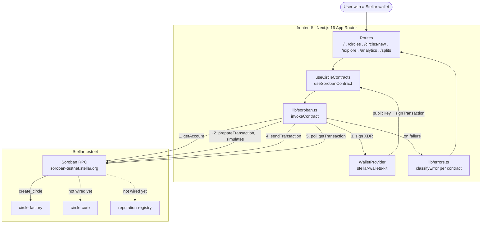
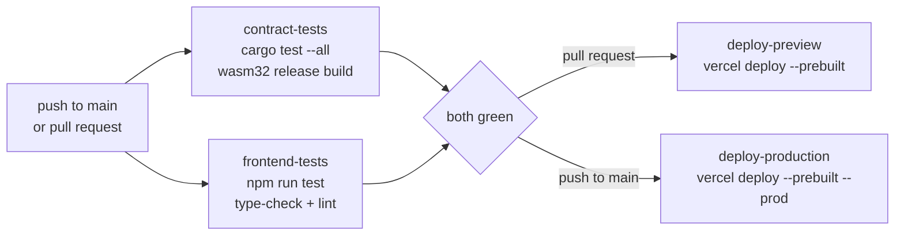
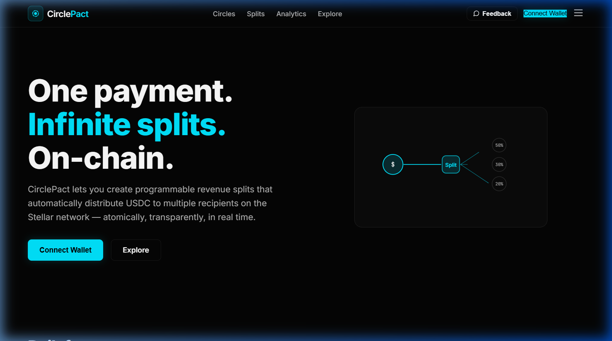
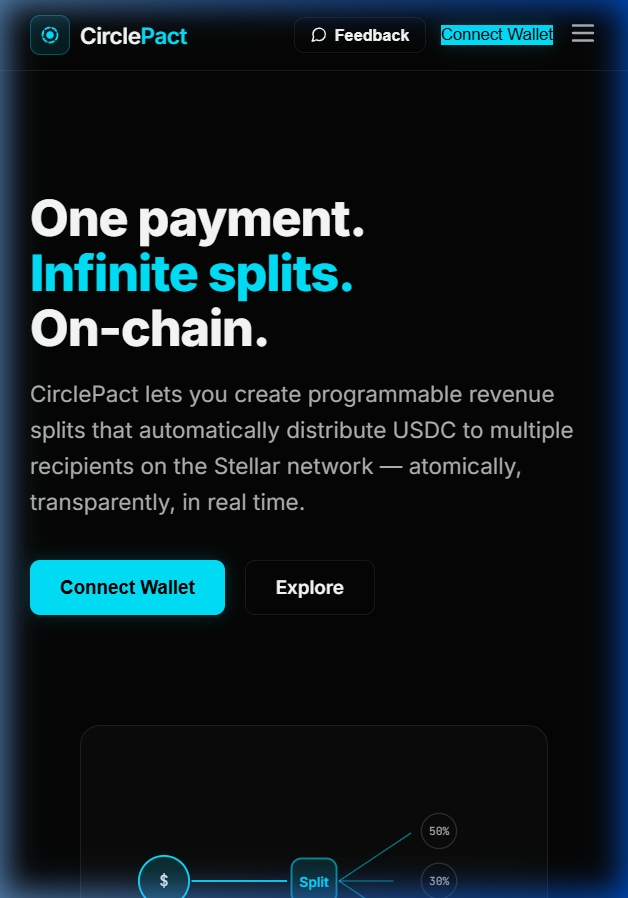
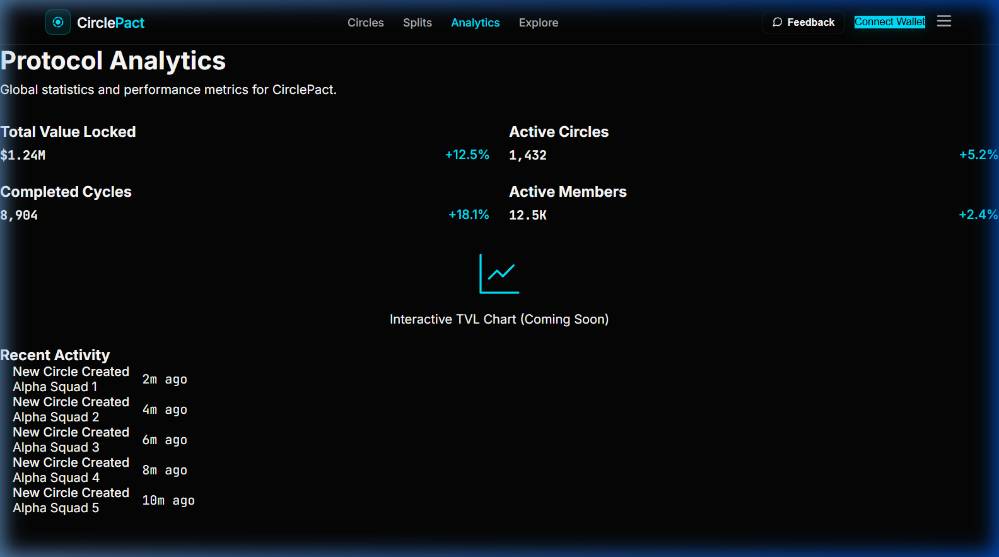

# CirclePact

ROSCA-style savings circles on Stellar. A group agrees on a fixed contribution,
everyone pays into each cycle, and the pot rotates to one member per cycle until
everyone has been paid once.

The repo is a monorepo: a Soroban contract workspace in Rust (`contracts/`) and a
Next.js 16 frontend (`frontend/`), plus compiled Midnight Compact artifacts
(`managed/`).

## Links

- Live demo: [https://circlepact-mvp.vercel.app](https://circlepact-mvp.vercel.app)
- Demo walkthrough: [assets/demo_walkthrough.md](assets/demo_walkthrough.md)
- GitHub repository: [https://github.com/V1shnuuu/Orange](https://github.com/V1shnuuu/Orange)
- CI pipeline: [.github/workflows/ci.yml](.github/workflows/ci.yml)

Contracts deployed on Stellar testnet:

- circle-factory: [CDVNCAGXECSZPB57C5V5DXX3LOLTTMLQETR4EZXI6X3LSWTUBXGERVMX](https://stellar.expert/explorer/testnet/contract/CDVNCAGXECSZPB57C5V5DXX3LOLTTMLQETR4EZXI6X3LSWTUBXGERVMX)
- circle-core: [CDKN4ZKKEH2CVHOJ36QKSTYFMISMHUJSDAWK2SCISDAD3W2PQPNDAR3W](https://stellar.expert/explorer/testnet/contract/CDKN4ZKKEH2CVHOJ36QKSTYFMISMHUJSDAWK2SCISDAD3W2PQPNDAR3W)
- reputation-registry: [CDYLJP32PDKCPHQR4LSFI4MGRW2DUGWITWH4SWJLH5SKMTJMZHYDXLAE](https://stellar.expert/explorer/testnet/contract/CDYLJP32PDKCPHQR4LSFI4MGRW2DUGWITWH4SWJLH5SKMTJMZHYDXLAE)

> The deployed `circle-core` and `reputation-registry` builds lag this repo.
> `circle-core.initialize` now takes the circle's fixed contribution amount and
> `contribute` rejects any other figure; `reputation-registry` gained a
> `record_circle_joined` entry point. Both need redeploying before the addresses
> above match the source. `circle-factory` is unchanged and matches.

Midnight: `contracts/CirclePact.compact` compiles against the Compact standard
library and its artifacts are checked into `managed/`, but it is not deployed to
a live Midnight network.

## Features

- **Five Soroban contracts** (`soroban-sdk` 22): `circle-factory` registers
  circles per admin, `circle-core` runs the ROSCA cycle engine, and
  `reputation-registry` tracks per-member scores. `split-registry` and
  `payment-vault` implement a separate payment-splitting flow.
- **Fixed-amount cycle engine.** The per-cycle contribution is set at
  `initialize` and `contribute` rejects anything else, so the pot always equals
  `contribution x member_count`. A circle auto-starts once it fills, and payouts
  rotate in join order until every member has been paid once.
- **Reputation scoring.** Successful, late, and defaulted cycles feed a
  completion rate and badge tiers (Bronze → Diamond). A single default clears a
  member's badge.
- **Wallet onboarding** through `@creit.tech/stellar-wallets-kit`, loaded
  dynamically so the kit is only fetched when a user connects.
- **Full transaction lifecycle in the UI** — simulate, sign, submit, poll for
  confirmation — with contract errors decoded against the contract that raised
  them rather than a single shared table.
- **SEO routes** generated from one canonical origin: `app/robots.ts` and
  `app/sitemap.ts` both read `SITE_URL` from `lib/site.ts`.
- **CI gates everything**: contract tests, wasm build, frontend tests, type
  check, lint, then Vercel preview/production deploys.

## Workflow

How a circle creation travels from the browser to the chain. Solid edges are
live today; dashed edges are contracts that exist and are tested but are not yet
called from the frontend (see [Current limitations](#current-limitations)).


```mermaid
flowchart TD
    User(["User with a Stellar wallet"])

    subgraph fe["frontend/ - Next.js 16 App Router"]
        Pages["Routes<br>/ . /circles . /circles/new . /explore . /analytics . /splits"]
        Wallet["WalletProvider<br>stellar-wallets-kit"]
        Hooks["useCircleContracts<br>useSorobanContract"]
        Invoke["lib/soroban.ts<br>invokeContract"]
        Errors["lib/errors.ts<br>classifyError per contract"]
    end

    subgraph chain["Stellar testnet"]
        RPC["Soroban RPC<br>soroban-testnet.stellar.org"]
        Factory["circle-factory"]
        Core["circle-core"]
        Rep["reputation-registry"]
    end

    User --> Pages
    Pages --> Hooks
    Wallet -->|"publicKey + signTransaction"| Hooks
    Hooks --> Invoke

    Invoke -->|"1. getAccount"| RPC
    Invoke -->|"2. prepareTransaction, simulates"| RPC
    Invoke -->|"3. sign XDR"| Wallet
    Invoke -->|"4. sendTransaction"| RPC
    Invoke -->|"5. poll getTransaction"| RPC
    Invoke -->|"on failure"| Errors
    Errors --> Pages

    RPC -->|"create_circle"| Factory
    RPC -.->|"not wired yet"| Core
    RPC -.->|"not wired yet"| Rep
```

## Installation

Prerequisites: Rust with the `wasm32-unknown-unknown` target, Node.js 20+, and a
Stellar wallet extension (Freighter, xBull, or Albedo) for the browser.

```bash
# clone the repository
git clone https://github.com/V1shnuuu/Orange.git
cd Orange

# build smart contracts
cd contracts
cargo build --target wasm32-unknown-unknown --release

# run the frontend
cd ../frontend
npm install
npm run build
npm run start
```

For frontend development with hot reload, use `npm run dev` instead of
`npm run build && npm run start`.

## Usage

Frontend scripts, all run from `frontend/`:

| Script | What it does |
|--------|--------------|
| `npm run dev` | Next dev server on `localhost:3000` |
| `npm run build` | Production build |
| `npm run start` | Serve the production build |
| `npm run test` | Vitest suite (jsdom) |
| `npm run type-check` | `tsc --noEmit` |
| `npm run lint` | ESLint |
| `npm run format` | Prettier over `ts,tsx,md,json` |

Contract commands, run from `contracts/`:

```bash
cargo test --all                                    # unit tests for all five crates
cargo build --target wasm32-unknown-unknown --release  # deployable wasm
```

Once the app is running: connect a wallet, then **Create Circle** builds a real
`circle-factory.create_circle` transaction — simulated, signed in your wallet,
submitted to testnet, and polled until confirmation. The returned hash is stored
on the circle and the UI marks it as on-chain. If the account has never been
funded, the error path offers a Friendbot link to fund it with test XLM.

## Configuration

The frontend reads these at build time. `frontend/.env.example` is a starting
point but is incomplete: it covers the network settings and the split/vault
contract IDs, so the three circle contract IDs and `NEXT_PUBLIC_SITE_URL` need
adding by hand.

| Variable | Default | Purpose |
|----------|---------|---------|
| `NEXT_PUBLIC_STELLAR_RPC_URL` | `https://soroban-testnet.stellar.org` | Soroban RPC endpoint |
| `NEXT_PUBLIC_STELLAR_NETWORK_PASSPHRASE` | `Test SDF Network ; September 2015` | Network passphrase for signing |
| `NEXT_PUBLIC_STELLAR_NETWORK` | `testnet` | Gates testnet-only features such as Friendbot |
| `NEXT_PUBLIC_CIRCLE_FACTORY_CONTRACT_ID` | empty | circle-factory address |
| `NEXT_PUBLIC_CIRCLE_CORE_CONTRACT_ID` | empty | circle-core address |
| `NEXT_PUBLIC_REPUTATION_REGISTRY_CONTRACT_ID` | empty | reputation-registry address |
| `NEXT_PUBLIC_SPLIT_REGISTRY_CONTRACT_ID` | empty | split-registry address |
| `NEXT_PUBLIC_PAYMENT_VAULT_CONTRACT_ID` | empty | payment-vault address |
| `NEXT_PUBLIC_USDC_TOKEN_CONTRACT_ID` | empty | Token contract moved by `contribute` |
| `NEXT_PUBLIC_SITE_URL` | `https://circlepact-mvp.vercel.app` | Canonical origin for `robots.txt` and `sitemap.xml` |

Set `NEXT_PUBLIC_SITE_URL` per deployment so preview builds advertise themselves
rather than pointing crawlers at production.

Vercel deploys additionally need `VERCEL_TOKEN`, `VERCEL_ORG_ID`, and
`VERCEL_PROJECT_ID` as repository secrets.

## Project structure

```
.
├── contracts/                   Soroban workspace (Rust, soroban-sdk 22)
│   ├── circle-factory/          create_circle, per-admin circle registry
│   ├── circle-core/             ROSCA engine: join, contribute, rotate payouts
│   ├── reputation-registry/     per-member scores and badge tiers
│   ├── split-registry/          recipient and share configuration
│   ├── payment-vault/           distributes one payment across a split
│   ├── CirclePact.compact       Midnight Compact contract source
│   └── Cargo.toml               workspace members and release profile
├── frontend/                    Next.js 16 App Router, React 19, Tailwind 4
│   ├── src/app/                 routes plus robots.ts and sitemap.ts
│   ├── src/components/          UI components and __tests__/
│   ├── src/hooks/               wallet, contract, and UI hooks
│   ├── src/lib/                 soroban.ts, stellar.ts, contracts.ts, errors.ts, site.ts
│   └── vitest.config.ts         jsdom test setup
├── managed/                     compiled Midnight Compact artifacts
├── assets/                      screenshots and supporting documents
├── .github/workflows/ci.yml     tests, wasm build, Vercel deploys
├── CONTRIBUTING.md
└── LICENSE
```

## Testing and CI

Verified locally on 2026-08-19:

- `cargo test --all` in `contracts/` — **40 tests** across the five crates
- `npm run test` in `frontend/` — **84 tests** across 11 files
- `npm run type-check` — clean
- `npm run lint` — 0 errors, 2 unused-parameter warnings in the not-yet-wired
  `contributeToCircle` stub
- `npm run build` — 12 routes, including the generated `/robots.txt` and
  `/sitemap.xml`

Every one of those is gated in [.github/workflows/ci.yml](.github/workflows/ci.yml):


```mermaid
flowchart LR
    Trigger["push to main<br>or pull request"] --> CT["contract-tests<br>cargo test --all<br>wasm32 release build"]
    Trigger --> FT["frontend-tests<br>npm run test<br>type-check + lint"]
    CT --> Gate{"both green"}
    FT --> Gate
    Gate -->|"pull request"| Preview["deploy-preview<br>vercel deploy --prebuilt"]
    Gate -->|"push to main"| Prod["deploy-production<br>vercel deploy --prebuilt --prod"]
```

## Current limitations

Worth knowing before reading the code:

- **Circle creation is on-chain; joining and contributing are not.**
  `useCircleContracts.createCircle()` submits a real testnet transaction. Joining
  and contributing are still tracked in React state, because the deployed
  `circle-core` is a single-instance contract — it holds exactly one circle's
  worth of state and was never initialized — while `circle-factory` never
  deploys a fresh `circle-core` per circle. Supporting concurrent circles needs
  either a per-circle deployment step or a multi-tenant rewrite of
  `circle-core`, plus a real test token for `contribute()` to move. The UI
  labels which parts of a circle are on-chain.
- **The `/splits` pages are UI-only.** `split-registry` and `payment-vault` are
  implemented and tested, but nothing in the frontend invokes them;
  `useDistributionEvents` returns generated events.
- **`reputation-registry.update_score` has no authorization.** Any caller can
  write any member's score. It needs restricting to the factory/core contracts
  before this goes near mainnet.
- **In-app feedback is not persisted.** `FeedbackModal` logs to the console; it
  needs an API route or webhook before it collects anything.

## Screenshots

### Desktop Product UI


### Mobile Responsive Design


### Analytics Dashboard


## Product Improvements Shipped

Changes from an internal UX and code audit of the MVP. These are **not** driven
by collected user feedback — none has been gathered yet. Listed with commit
links so the history is traceable.

| Area | Improvement | Commit |
|------|-------------|--------|
| UX / stability | Rebuilt the visual language on a real design-token system. Tailwind was configured but never generating utility classes, so much of the UI was silently rendering unstyled — this fixes the root cause and restyles every page and component. | [`ddbde95`](https://github.com/V1shnuuu/Orange/commit/ddbde95) |
| Onboarding | Wallet-connect failures raised a bare rejection object that the error classifier could not read, so users saw nothing useful. Errors are now classified correctly and surface a wallet-install modal with Freighter / xBull / Albedo links. | [`ddbde95`](https://github.com/V1shnuuu/Orange/commit/ddbde95), [`bb2892f`](https://github.com/V1shnuuu/Orange/commit/bb2892f) |
| Onboarding | Circle creation waited on a fixed `setTimeout` before navigating instead of on the actual transaction result, and offered no fallback if navigation failed. Now navigates on real success with a manual "View Circle" fallback. | [`bb2892f`](https://github.com/V1shnuuu/Orange/commit/bb2892f) |
| UX | "Circle not found" rendered as bare unstyled text with no way back. Replaced with the app's standard empty state and a link to browse circles. | [`bb2892f`](https://github.com/V1shnuuu/Orange/commit/bb2892f) |
| Feedback capture | The in-app feedback modal's close button was unclickable (a sibling layer intercepted the click) and would have submitted the form once reachable. Fixed, with Escape-to-close and regression tests added. | [`ddbde95`](https://github.com/V1shnuuu/Orange/commit/ddbde95) |
| Integrity | Removed fabricated user-activity evidence (a script that generated fake wallets and transaction hashes) and replaced it with honest templates to be filled with real data. | [`49daf61`](https://github.com/V1shnuuu/Orange/commit/49daf61) |

## Validation material

Supporting documents for the project submission. Templates that have not been
filled with real data say so on the page rather than showing placeholder
figures:

- Wallet interaction proof: [wallet_interactions_proof.md](wallet_interactions_proof.md) — empty template, no onboarded users yet
- User feedback summary: [user_feedback_summary.md](user_feedback_summary.md) — no responses collected yet
- Product validation overview: [assets/PRODUCT_VALIDATION.md](assets/PRODUCT_VALIDATION.md)
- Feedback form spec, ready to build: [assets/google_form_spec.md](assets/google_form_spec.md)
- Pitch deck content, deck not yet built: [assets/pitch_deck_content.md](assets/pitch_deck_content.md)

Feedback collection has not started, so nothing in
[Product Improvements Shipped](#product-improvements-shipped) traces to user
input yet. Once responses exist, each feedback-driven change gets added to that
table with its commit link.

## Contributing

See [CONTRIBUTING.md](CONTRIBUTING.md) for environment setup, coding standards,
and the pull request process. Before opening a PR, run what CI runs:

```bash
cd contracts && cargo test --all
cd ../frontend && npm run test && npm run type-check && npm run lint
```

## License

MIT — see [LICENSE](LICENSE).
